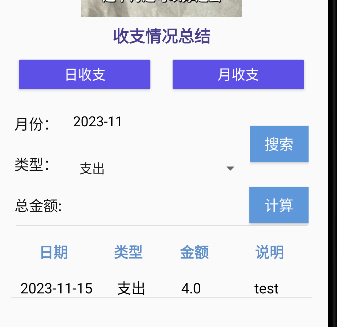

# 期末项目-记账本&&记事本app

- 

**期末项目-记账本&&记事本app**

**项目开发背景**

**项目介绍**

​	1、用户管理

​		1.1 注册

​		1.2 登录

​		1.3 修改密码

​		1.4 切换账号

​		1.5 退出

​	2、记账

​		2.1 添加账单记录

​		2.2 修改已有记录

​		2.3 删除已有记录

​	3、记事

​		3.1 添加事务记录

​	4、账目统计

​		4.1 日收支情况查看

​		4.2 月收支情况查看

​	5、记事总览

​		5.1 记事本查看

​		5.2 已有记录删除

​		5.3 已有记录修改

**技术栈和开发工具**

**项目结构**

代码文件介绍

**功能截图**

​	1、程序logo

​	2、用户管理功能

​		2.1 登陆界面

​		2.2 注册界面

​		2.3 登录后界面（主界面）

​		2.4 个人中心

​		2.5 密码修改

​		2.6 切换账号&&退出

​	3、记账功能

​		3.1 添加账单记录

​		3.2 修改已有记录

​		3.3 删除已有记录

​	4、记事功能

​		4.1 添加事务记录

​	5、账目统计功能

​		5.1 查看日收支情况

​		5.2 查看月收支情况

​	6、记事总览功能

​		6.1 查看记事本

​		6.2 修改已有记录

​		6.3 删除已有记录

**未来展望**

## **项目开发背景** 

在当今繁忙的生活中，个人财务管理和事务记录变得愈发重要。随着数字化时代的到来，人们需要一种方便、直观的方式来追踪他们的财务状况和重要事务。传统的纸质记账本和手写记事方式逐渐显得过时，用户更期望拥有一款便捷、高效的移动应用来管理他们的财务和日常事务。 

本项目的开发背景正是出于对这一需求的深刻理解。我们意识到，在繁杂的日常生活中，人们常常需要一款集中管理财务和事务的应用，以提高他们对自己财务状况和生活琐事的了解。因此，我们决定开发一款同时具备记账本和记事簿功能的移动应用，旨在为用户提供全面的个人管理体验。

这款应用的目标是通过整合记账和记事功能，帮助用户更好地理解他们的财务状况，同时能够方便地记录和追踪个人事务。我们希望提供一个直观、用户友好的界面，使用户能够轻松地进行账目统计、事务记录和信息查看。通过数字化的方式，用户能够更快速地获取和分析他们的财务和事务数据，使他们在日常生活中更加得心应手。

## 项目介绍

本次期末项目我使用本学期所学的Android开发知识，开发了一个具有记账和记事两种功能的记录APP，该APP具有如下功能：

### 1、用户管理

#### 1.1 注册

完成用户的注册任务，后续可以通过注册时登记的用户ID和密码登录app，获取登录用户的记录。

该功能通过登录界面的“现在注册”语句进入，在进入了注册页面后，输入用户ID和密码，即可完成注册，后续所有记录与账号绑定

#### 1.2 登录

通过用户ID和密码验证用户身份，完成登录，获取该用户在之前的记录。

该功能需要用户在登录界面输入已注册的用户ID和密码，并点击登录按钮完成，后台会等输入的用户ID和密码进行验证，验证通过才能进入主界面。且提供了记住密码功能，在勾选后，用户ID和密码将会被保存。

#### 1.3 修改密码

在登录后，允许用户修改自己的密码。

用户可以通过点击“User ID”进入个人中心，并点击修改密码按钮进入修改密码界面，在该界面输入原密码，并重复输入两次新密码，并确认，即可完成密码修改。

#### 1.4 切换账号

在登录后，可以退出当前登录的账号，返回登录界面。

用户可以通过点击“User ID”进入个人中心，并点击切换账号退出当前账号，返回登录界面登录新账号。

#### 1.5 退出

关闭app。

用户可以通过点击“User ID”进入个人中心，并点击退出按钮关闭APP。

### 2、记账

#### 2.1 添加账单记录

可以添加一条账单记录，记录的信息包括日期、收入\支出、金额、说明。

通过主界面进入添加记录界面，填入四个信息（日期、收入还是支出、金额、说明），然后单击添加按钮，即可添加一条账单记录。

#### 2.2 修改已有记录

可以选择一条已有记录进行修改。

在添加记录界面，选择一条记录，可以对这条记录进行更改（包括日期、收入还是支出、金额、说明），随后通过单击修改按钮，即可将修改保存。

#### 2.3 删除已有记录

可以选择已有记录进行删除。

在添加记录界面，选择一条记录，并单击删除按钮，即可删除选中的记录。

### 3、记事

#### 3.1 添加事务记录

用户可以通过该功能完成记事任务。

通过主界面进入添加记录界面，输入需要记录的内容，输入完成后，单击保存按钮即可将记录保存，同时提供了一个清空内容的按钮，可以将已输入的内容全部清空。

### 4、账目统计

#### 4.1 查看日收支情况

用户可以选择一个日期，查看该日期的收入或支出情况，支持具体记录的查看和金额的统计。

通过主界面进入账目统计界面，选择日收支，并选择日期和查看支出还是收入，随后单击搜索按钮，可以获取指定日期的所有支出\收入记录，并提供了统计功能，通过单击计算按钮，可以获取当日总支出\收入。

#### 4.2 查看月收支情况

用户可以选择一个月份，查看该月的收入或支出情况，同样支持具体记录的查看和金额的统计。

在账目统计界面，选择月收支，并选择月份和查看支出还是收入，随后单击搜索按钮，可以获取指定月份的所有支出\收入记录，并提供了统计功能，通过单击计算按钮，可以获取当日总支出\收入。

### 5、记事总览

#### 5.1 查看记事本

可以查看所有的记事记录。

通过主界面进入记事本界面，可以查看所有事务记录，可以通过点击想要查看的记录查看该记录的全部内容。

#### 5.2 修改已有记录

支持对已有记录的修改。

在进入某个具体记录后，可以直接对内容进行修改，修改完成后，单击保存按钮，即可将修改保存到记录中。

#### 5.3 删除已有记录

支持对已有记录的删除。

在记事本界面长按需要删除的记录，会跳出一个确认删除的提示框，单击确认删除，即可删除选定的记录。

## 技术栈和开发工具

在本项目的开发中，我们采用了Java作为主要编程语言，并结合了SQLite数据库用于高效地存储和管理用户的记账和记事数据。以下是项目中使用的主要技术栈和开发工具： 

**主要编程语言：** 

- **Java：**  作为我们项目的主要编程语言，Java的跨平台性和强大的生态系统为我们提供了稳健的开发基础。 

**数据库：** 

- **SQLite：**  作为一种轻量级、嵌入式的关系型数据库管理系统，SQLite为我们提供了高效的数据存储和检索能力，是理想的选择。 

**开发框架：** 

- **Spring Framework：**  我们选择了Spring Framework作为开发框架，以提供依赖注入、事务管理和Web开发等关键功能，从而简化开发流程。 

**开发工具：** 

- **IntelliJ IDEA：**  作为主要的集成开发环境（IDE），IntelliJ IDEA提供了强大的开发工具，包括代码自动完成、调试、代码分析等，使得开发更加高效。 

**构建工具：** 

- **Gradle：**  为了进行项目的依赖管理和构建，我们选择了Gradle。它能够简化项目配置，管理依赖项，并支持灵活的构建过程。 

**数据库工具：** 

- **SQLite数据库管理工具：**  用于管理和维护SQLite数据库，执行查询和监视数据库性能。 

通过采用这一技术栈和开发工具组合，我们能够高效地实现记账本和记事簿应用的功能，同时确保项目的稳定性和可维护性。Gradle作为构建工具能够使项目的构建过程更加灵活和高效。 

## 项目结构

代码部分

使用图片

界面设计

## 代码文件介绍

.

│  ChangePassword.java			#实现修改密码功能
│  HomepageActivity.java		  #APP主界面
│  LoginActivity.java					#登录界面
│  ManageActivity.java				#记账界面
│  NotebookActivity.java			 #记事本界面
│  PersonalInformation.java	  #个人中心界面
│  RecordActivity.java				  #记事界面
│  RegisterActivity.java				#注册界面
│  SearchRecordActivity.java	  #收支情况查询界面
│
├─adapter									 #适配器部分
│      NotebookAdapter.java
│      TallyAdapter.java
│
├─Bean										 #定义记事本信息实体等类										
│      NotebookBean.java
│      Tally.java
│      User.java
│
├─Database									#数据库部分
│      NotepadDB.java
│      NoteTB.java
│      TallyTB.java
│      UserTB.java
│
└─Utils											#工具类
        GApplication.java
        TimeUtil.java
        ToastUtil.java

## 功能截图

### 1、程序logo

### 2、用户管理功能

#### 2.1 登录界面

支持“记住密码功能”

在选择记住密码后，再次打开该APP，可以看到不需要再输入ID和密码

#### 2.2 注册界面

注册成功后显示

#### 2.3 登录后界面（主界面）

会在主界面显示用户的ID

#### 2.4 个人中心

通过单击如下部分进入

在这个界面下实现退出、切换账号、修改密码等操作

#### 2.5 密码修改

#### 2.6 切换账号&&退出

切换账号会返回登录界面，退出会直接结束app的运行

### 3、记账功能

通过单击如下图标进入

#### 3.1 添加账单记录

记录主界面

添加成功后提示

且多一条记录

#### 3.2 修改已有记录

修改前

修改后提示

且记录改变

#### 3.3 删除已有记录

删除前

删除后提示

删除后界面如下

### 4、记事功能

通过单击如下图标进入

#### 4.1 添加事务记录

记录主界面

通过如下按钮保存记录

通过如下按钮清空文字

保存后返回主界面，且提示

### 5、账目统计功能

通过单击以下图标进入

#### 5.1 查看日收支情况

收支情况主界面

选择日收支以查看日收支情况

选择日期

选择查看收入还是支出

搜索记录

统计金额

#### 5.2 查看月收支情况

选择月份和想要查看收入还是支出

选择月收支以查看月收支情况

搜索记录

统计金额

### 6、 记事总览功能

通过单击以下图标进入

#### 6.1 查看记事本

具体查看

可以通过单击如下图标进入事务记录界面

#### 6.2 修改已有记录

对具体记录修改

保存

#### 6.3 删除已有记录

长按需要删除的记录后，唤起确认界面

选择确认删除

## 未来展望

1、该app的界面设计有待优化，在后续工作中希望整体设计遵循Google提出的Material design设置规范，⼤量采⽤了MD设计⻛格的组件。

2、目前app界面的跳转（指返回主界面），需要通过手机返回键完成，后续希望加入回退按钮。

3、目前在某个具体功能使用后，可能需要返回主界面重新进入，如在添加一条记账记录后，无法立即删除该条记录，需要返回主界面重新进入，这一问题希望能在后续工作中优化。