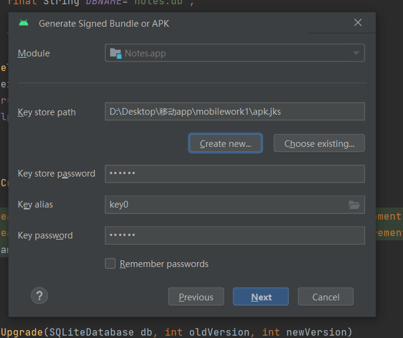

# 作业1

## 1、作业要求

下载Android Studio，搭建Android应用开发环境，熟悉基本Android开发、调试工具。用AndroidStudio创建第一个Android应用，对该应用进行签名，并能把该应用部署至Android模拟器、GenyMotion模拟器和真机上。编写一个Android应用程序，练习各种Android控件的使用，可模仿常用的工具类应用或热门应用的界面来完成自己应用界面的布局。要求下列每一组组件都要用到，每一组组件至少使用其中一种组件。

1）布局管理器

2）TextView及其子类

3）ImageView及其子类

4）AdapterView及其子类

5）ProgressBar及其子类

6）ViewAnimator及其子类

7）各种杂项组件

8）对话框

## 2、环境

jbr-17

Android Studio Giraffe | 2022.3.1 Patch 2

## 3、各组件使用情况举例

### 1）布局管理器

```
    <LinearLayout
        android:layout_width="wrap_content"
        android:layout_height="wrap_content"
        android:gravity="center_horizontal"
        android:layout_marginTop="20dp"
        android:orientation="horizontal">

    </LinearLayout>
```

### 2）TextView及其子类

```
    <TextView
        android:id="@+id/number"
        android:layout_width="wrap_content"
        android:layout_height="wrap_content"
        android:text="0字"
        android:textSize="16sp"
        android:layout_marginTop="20dp"
        app:layout_constraintEnd_toEndOf="parent"
        app:layout_constraintHorizontal_bias="0.077"
        app:layout_constraintStart_toEndOf="@+id/time"
        app:layout_constraintTop_toTopOf="parent"  />
```

### 3）ImageView及其子类

```
    <ImageView
        android:id="@+id/del"
        android:layout_width="30dp"
        android:layout_height="30dp"
        android:src="@drawable/del"
        android:layout_gravity="end" />
```

### 4）AdapterView及其子类

```
    <ListView
        android:id="@+id/listView"
        android:layout_marginTop="5dp"
        android:layout_width="match_parent"
        android:layout_height="match_parent"/>
```

### 5）ProgressBar及其子类

```
    <ProgressBar
        android:id="@+id/progressBar"
        style="?android:attr/progressBarStyleHorizontal"
        android:layout_width="265dp"
        android:layout_height="wrap_content"
        android:max="100"
        android:visibility="invisible"/>
```

### 6）ViewAnimator及其子类

```
    <ViewAnimator
        android:id="@+id/viewAnimator"
        android:layout_width="match_parent"
        android:layout_height="match_parent">


        <ImageView
            android:layout_width="match_parent"
            android:layout_height="match_parent"
            android:scaleType="centerCrop"
            android:src="@drawable/welcome1" />

        <ImageView
            android:src="@drawable/welcome2"
            android:layout_width="match_parent"
            android:layout_height="match_parent"
            android:scaleType="centerCrop"/>

    </ViewAnimator>
```

### 7）各种杂项组件

```
    <androidx.appcompat.widget.SearchView
        android:id="@+id/searchView"
        android:layout_width="match_parent"
        android:layout_height="wrap_content"
        android:layout_marginTop="10dp"
        app:iconifiedByDefault="false"
        android:background="@drawable/edittext_style"
        app:queryHint="输入内容进行搜索"
        android:layout_marginHorizontal="20dp"/>
```

### 8）对话框

```
                        handler.post(new Runnable() {
                            @Override
                            public void run() {
                                new AlertDialog.Builder(AddNote.this)
                                        .setTitle("确认修改")
                                        .setMessage("确定要修改该记事本吗？")
                                        .setNegativeButton("取消", new DialogInterface.OnClickListener() {
                                            @Override
                                            public void onClick(DialogInterface dialog, int which) {
                                                // 用户点击取消，不做任何操作
                                            }
                                        })
                                        .setPositiveButton("确定", new DialogInterface.OnClickListener() {
                                            @Override
                                            public void onClick(DialogInterface dialog, int which) {
                                                // 用户点击确定，执行修改操作
                                                //Toast.makeText(AddNote.this, "确定按钮被点击了", Toast.LENGTH_SHORT).show();
                                                if (dbOpenHelper.updateNotes(String.valueOf(note.getId()), title.getText().toString(), content.getText().toString(), simpleDateFormat.format(date))) {
                                                    Toast.makeText(AddNote.this, "修改成功！", Toast.LENGTH_SHORT).show();
                                                    finish();
                                                } else {
                                                    Toast.makeText(AddNote.this, "未知错误", Toast.LENGTH_SHORT).show();
                                                }
                                            }
                                        })
                                        .show();
                            }
                        });
```

## 4、对该应用进行签名





## 5、模拟器使用


## 6、真机使用


