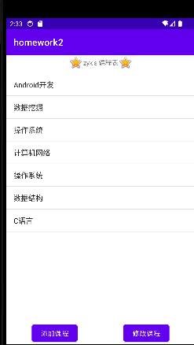
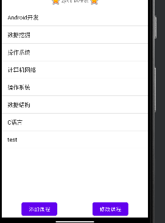
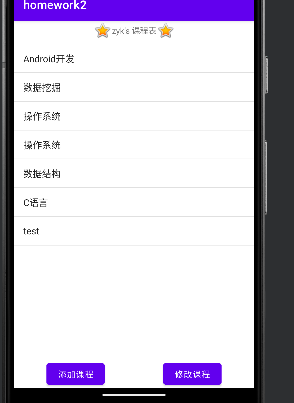
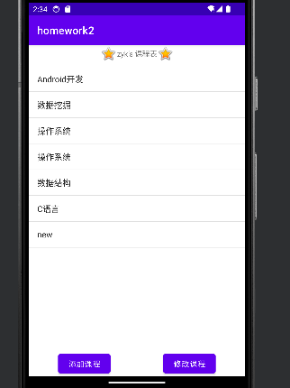

# 作业2

## 1、作业要求

建立一个SQLite数据库，并建立至少一个表，向表内添加一些数据。建立一个ContentProvider对该数据库的访问进行封装，并提供访问接口。开发一个测试应用，能够通过ContentResolver对前一应用的数据库进行增删改查。

## 2、环境

jbr-17

Android Studio Giraffe | 2022.3.1 Patch 2

## 3、数据库实现

```
public class CourseDBHelper extends SQLiteOpenHelper {
    private static CourseDBHelper mInstance;
    public final static String TABLE_NAME = "courses";
    private final static int DB_VERSION = 1;

    private CourseDBHelper(Context context, String name, SQLiteDatabase.CursorFactory factory, int version) {
        super(context, name, factory, version);
    }

    public static synchronized CourseDBHelper getInstance(Context context) {
        if(mInstance == null) {
            mInstance = new CourseDBHelper(context, "name_list.db", null, DB_VERSION);
        }
        return mInstance;
    }

    @Override
    public void onCreate(SQLiteDatabase db) {
        String CREATE_NAME_LIST_TABLE = "create table " + TABLE_NAME + " (" +
                "id integer primary key autoincrement, " +
                "courseName text)";
        db.execSQL(CREATE_NAME_LIST_TABLE);

        List<String> courses = Arrays.asList("Web程序设计", "Android引用开发", "大数据处理", "操作系统", "计算机网络", "操作系统", "数据结构", "C语言");
        for (String course : courses) {
            ContentValues values = new ContentValues();
            values.put("courseName", course);
            db.insert(TABLE_NAME, null, values);
        }
    }

    @Override
    public void onUpgrade(SQLiteDatabase db, int oldVersion, int newVersion) {

    }
}
```

## 4、ContentProvider接口

```
public class CourseProvider extends ContentProvider {
    private final static String TAG = "CourseProvider";

    private SQLiteDatabase db = null;
    private final static int COURSE = 1;
    private final static int COURSES = 2;
    private final static String TABLE = CourseDBHelper.TABLE_NAME;

    private final static String AUTHORITY = "com.frezcirno.mobile2db.provider";
    private static final UriMatcher uriMatcher = new UriMatcher(UriMatcher.NO_MATCH);

    static {
        uriMatcher.addURI(AUTHORITY, "course/#", COURSE);
        uriMatcher.addURI(AUTHORITY, "course", COURSES);
    }

    @Override
    public boolean onCreate() {
        db = CourseDBHelper.getInstance(getContext()).getWritableDatabase();
        return db != null;
    }

    @Override
    public Cursor query(
            Uri uri,
            String[] projection,
            String selection,
            String[] selectionArgs,
            String sortOrder) {
        int matchType = uriMatcher.match(uri);
        Cursor cursor = null;
        switch (matchType) {
            case COURSE:
                String id = uri.getPathSegments().get(1);
                cursor = db.query(TABLE, projection, "id=?", new String[]{id}, null, null, sortOrder);
                break;
            case COURSES:
                cursor = db.query(TABLE, projection, selection, selectionArgs, null, null, sortOrder);
                break;
            default:
                break;
        }
        return cursor;
    }

    @Override
    public String getType(Uri uri) {
        int matchType = uriMatcher.match(uri);
        switch (matchType) {
            case COURSE:
                return "vnd.android.cursor.item/vnd.com.frezcirno.mobile2db.provider.course";
            case COURSES:
                return "vnd.android.cursor.dir/vnd.com.frezcirno.mobile2db.provider.course";
            default:
                return null;
        }
    }

    @Override
    public Uri insert(Uri uri, ContentValues values) {
        int matchType = uriMatcher.match(uri);
        switch (matchType) {
            case COURSE:
            case COURSES:
                long rowId = db.insert(TABLE, null, values);
                if (rowId == -1) {
                    Log.e(TAG, "insert error");
                    return null;
                }
                break;
            default:
                break;
        }
        getContext().getContentResolver().notifyChange(uri, null);
        return null;
    }

    @Override
    public int delete(Uri uri, String selection, String[] selectionArgs) {
        int matchType = uriMatcher.match(uri);
        int rowId = 0;
        switch (matchType) {
            case COURSE:
            case COURSES:
                rowId = db.delete(TABLE, selection, selectionArgs);
                break;
            default:
                break;
        }
        getContext().getContentResolver().notifyChange(uri, null);
        return rowId;
    }

    @Override
    public int update(Uri uri, ContentValues values, String selection, String[] selectionArgs) {
        int matchType = uriMatcher.match(uri);
        int rowId = 0;
        switch (matchType) {
            case COURSE:
            case COURSES:
                rowId = db.update(TABLE, values, selection, selectionArgs);
                break;
            default:
                break;
        }
        getContext().getContentResolver().notifyChange(uri, null);
        return rowId;
    }
}
```

## 5、测试应用

```
package com.example.dbtest;

import androidx.appcompat.app.AlertDialog;
import androidx.appcompat.app.AppCompatActivity;

import android.content.ContentResolver;
import android.content.ContentValues;
import android.database.Cursor;
import android.net.Uri;
import android.os.Bundle;
import android.os.CountDownTimer;
import android.util.Log;
import android.view.View;
import android.widget.AdapterView;
import android.widget.ArrayAdapter;
import android.widget.Button;
import android.widget.EditText;
import android.widget.ListAdapter;
import android.widget.ListView;
import android.widget.TextView;
import android.widget.Toast;
import android.widget.ViewAnimator;

import java.util.ArrayList;
import java.util.List;

public class MainActivity extends AppCompatActivity {
    ArrayAdapter<String> adapter;

    @Override
    protected void onCreate(Bundle savedInstanceState) {
        super.onCreate(savedInstanceState);
        setContentView(R.layout.activity_main);

        ContentResolver resolver = getContentResolver();
        Cursor cursor = resolver.query(
                Uri.parse("com.example.dbtest.provider/course"),
                null,
                null,
                null,
                null
        );
        if (cursor == null) {
            Toast.makeText(this, "请先启动db程序", Toast.LENGTH_SHORT).show();
            finish();
            return;
        }

        List<String> courseList = new ArrayList<>();
        while (cursor.moveToNext()) {
            int courseIndex = cursor.getColumnIndex("courseName");
            String course = cursor.getString(courseIndex);
            courseList.add(course);
        }
        cursor.close();

        ListView listView = findViewById(R.id.lv);

        adapter = new ArrayAdapter<>(this, android.R.layout.simple_list_item_1, courseList);
        listView.setAdapter(adapter);

        Toast.makeText(this, "长按课程名删除课程", Toast.LENGTH_SHORT).show();

        listView.setOnItemLongClickListener((parent, view, position, id) -> {
            // prompt user to delete
            AlertDialog.Builder builder = new AlertDialog.Builder(this);
            builder.setTitle("Delete Course");
            builder.setMessage("Are you sure you want to delete this course?");
            builder.setPositiveButton("Yes", (dialog, which) -> {
                TextView tv = (TextView) view;
                String courseName = tv.getText().toString();
                courseList.remove(courseName);
                adapter.notifyDataSetChanged();
                resolver.delete(
                        Uri.parse("com.example.dbtest.provider/course"),
                        "courseName=?",
                        new String[]{courseName}
                );
            });
            builder.setNegativeButton("No", (dialog, which) -> {
                // do nothing
            });
            builder.show();
            return true;
        });

        Button add_btn = findViewById(R.id.button);
        add_btn.setOnClickListener(v -> {
            final EditText txtUrl = new EditText(this);

            AlertDialog.Builder builder = new AlertDialog.Builder(this);
            builder.setTitle("Add a course");
            builder.setMessage("Please enter the course name");
            builder.setView(txtUrl);
            builder.setPositiveButton("Add", (dialog, which) -> {
                String courseName = txtUrl.getText().toString();
                courseList.add(courseName);
                adapter.notifyDataSetChanged();
                ContentValues values = new ContentValues();
                values.put("courseName", courseName);
                resolver.insert(
                        Uri.parse("com.example.dbtest.provider/course"),
                        values
                );
            });
            builder.setNegativeButton("Cancel", (dialog, which) -> {
                // do nothing
            });
            builder.show();
        });

        Button update_btn = findViewById(R.id.button1);
        update_btn.setOnClickListener(v -> {
            AlertDialog.Builder builder = new AlertDialog.Builder(this);
            builder.setTitle("Update a course");
            builder.setView(R.layout.dialog_add_course);
            builder.setPositiveButton("Update", (dialog, which) -> {
                TextView oldCourseView = ((AlertDialog) dialog).findViewById(R.id.oldCourseName);
                TextView newCourseView = ((AlertDialog) dialog).findViewById(R.id.newCourseName);
                String oldCourseName = oldCourseView.getText().toString();
                String newCourseName = newCourseView.getText().toString();
                List<String> newCourseList = new ArrayList<>();
                for (String course : courseList) {
                    if (course.equals(oldCourseName)) {
                        newCourseList.add(newCourseName);
                    } else {
                        newCourseList.add(course);
                    }
                }
                courseList.clear();
                courseList.addAll(newCourseList);
                adapter.notifyDataSetChanged();
                ContentValues values = new ContentValues();
                values.put("courseName", newCourseName);
                resolver.update(
                        Uri.parse("com.example.dbtest.provider/course"),
                        values,
                        "courseName=?",
                        new String[]{oldCourseName}
                );
            });
            builder.setNegativeButton("Cancel", (dialog, which) -> {
                // do nothing
            });
            builder.show();
        });
    }
}
```

## 6、测试









